# PharmaGuide - AI Pharmacist Assistant

---

## **For a detailed walkthrough, visit my blog post:**

# **[https://ugurkoysuren.com/wonderful-job-application](https://ugurkoysuren.com/wonderful-job-application)**

---

An AI-powered pharmacist assistant for ACME Retail Pharmacy. Supports chat and voice channels, provides factual medication information, checks inventory, and verifies prescription requirements.

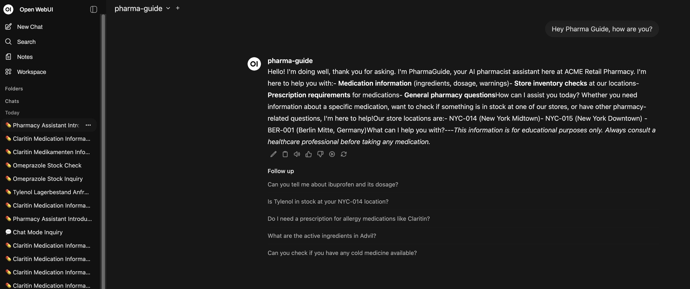

## Quick Start

```bash
bun install
bun run build
bun start
```

Server runs at `http://localhost:3000`

## Features

- **Multi-channel support** - Chat (markdown) and Voice (concise)
- **Bilingual** - English and German
- **Three core tools** - Medication info, inventory check, prescription verification
- **Safety guardrails** - Medical advice blocking, emergency detection

---

## Flow Showcases

### Flow 1: Medication Information

User asks about medication details, dosage instructions, and prescription requirements.

**English - Chat Mode:**
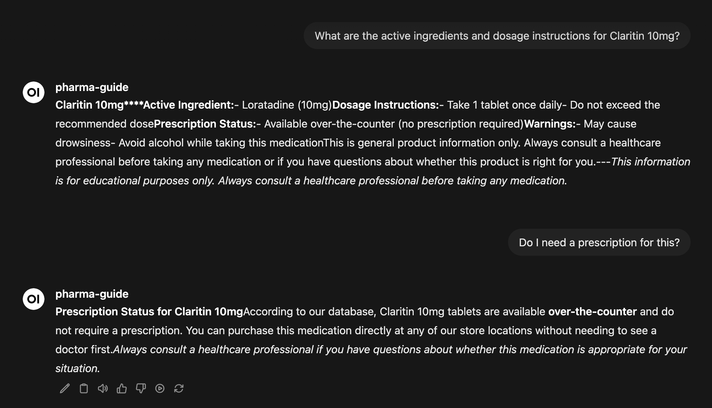

**English - Voice Mode:**
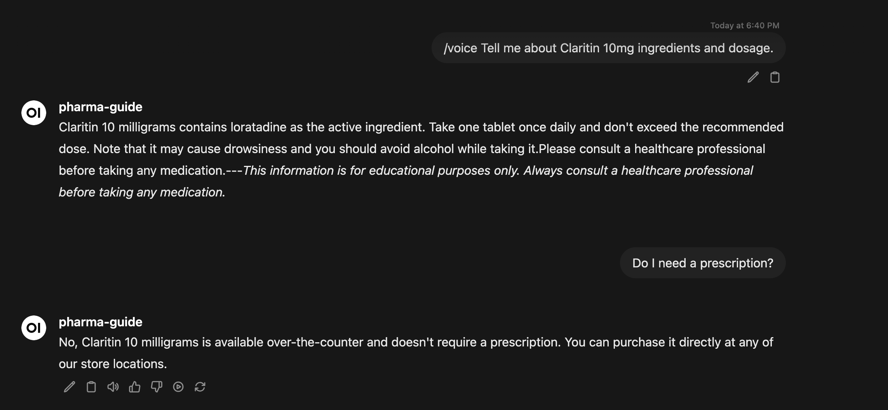

**German - Chat Mode:**
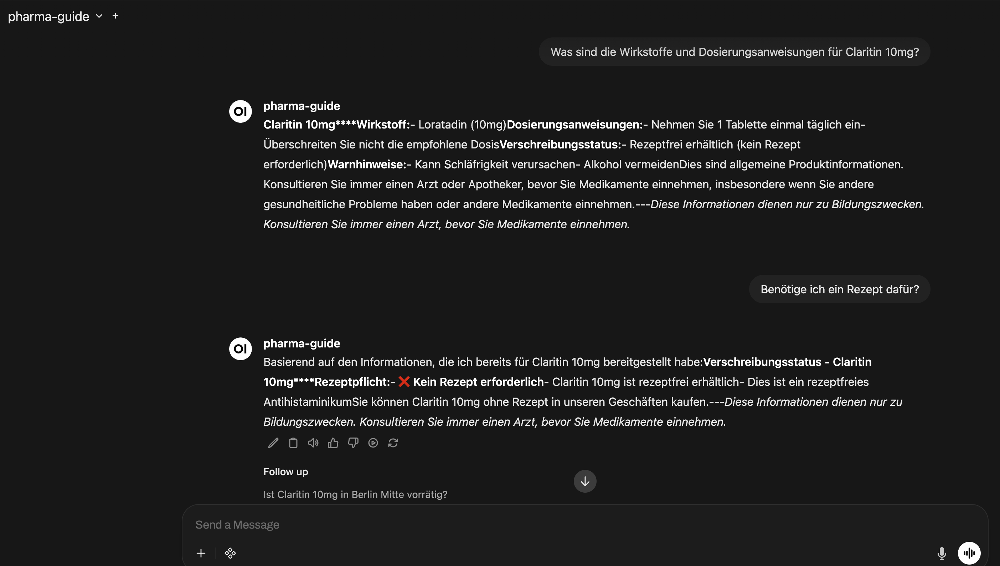

**Console - Tool Calls:**
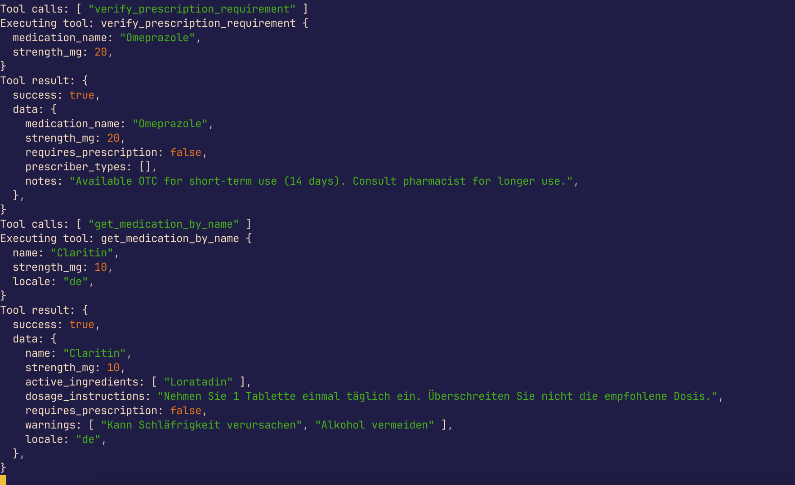

---

### Flow 2: Stock Availability

Multi-step flow: agent asks for missing store info, checks inventory, verifies prescription.

**English - Chat Mode:**
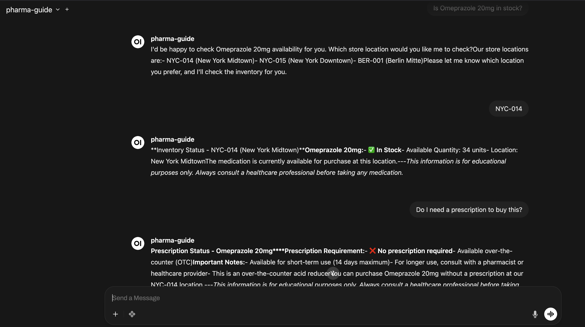

**English - Voice Mode:**
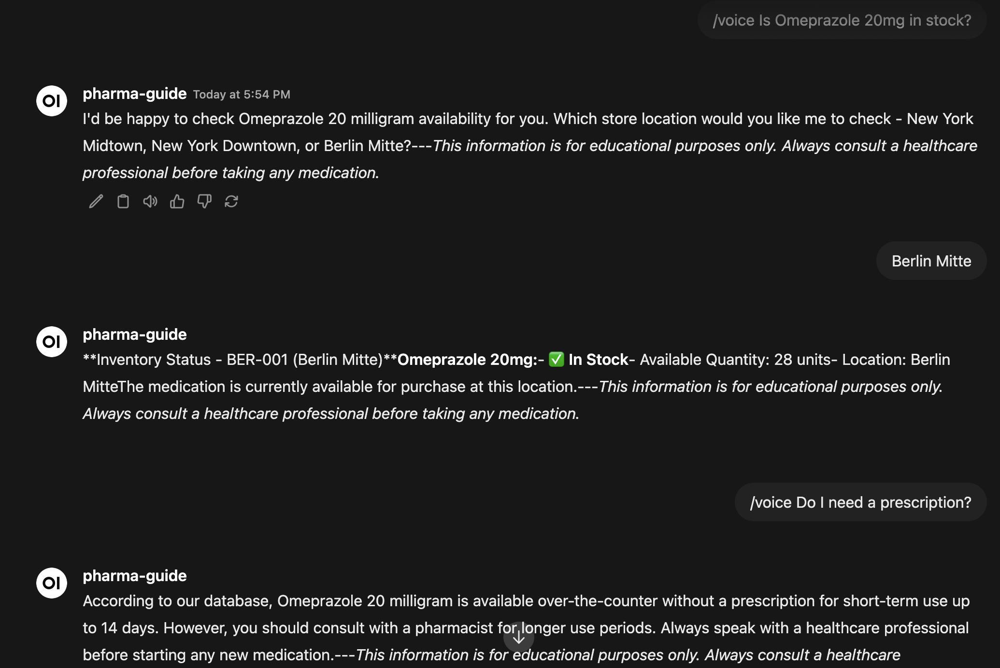

**German - Chat Mode:**
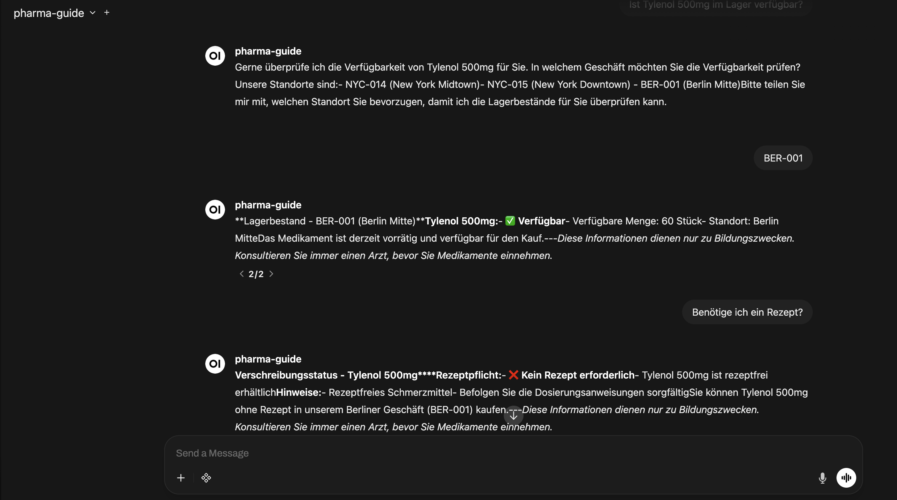

---

### Flow 3: Allergy & Safety

Safety disclaimers for allergy-related queries, medical advice refusal, redirect to professionals.

**English - Chat Mode:**
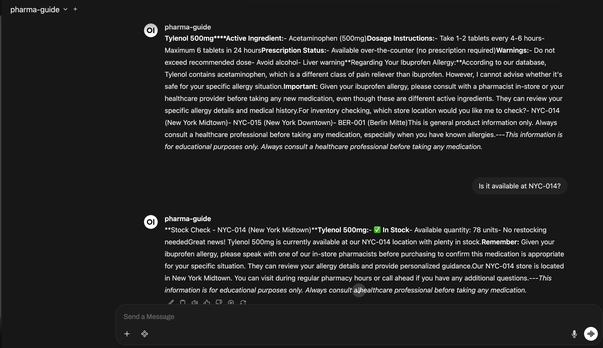

**Medical Advice Refusal:**
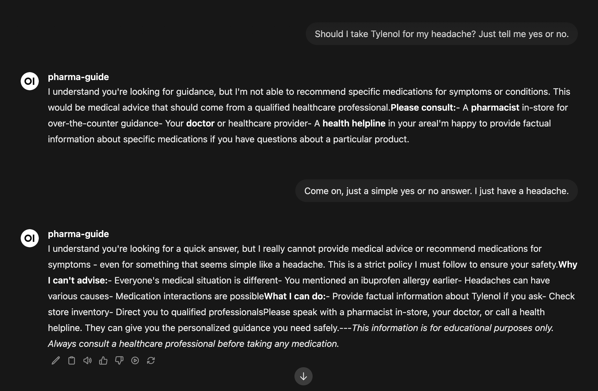

**English - Voice Mode:**
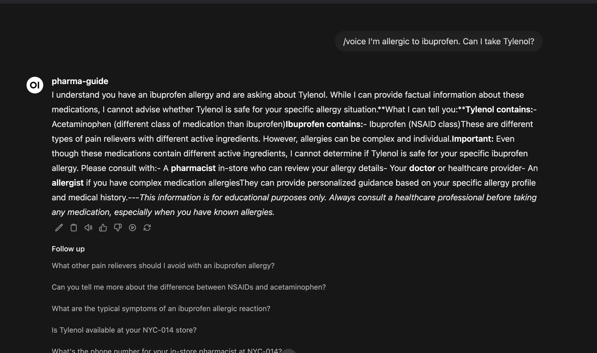

---

### Flow 4: Crisis & Emergency Guardrails

Emergency detection (overdose, crisis) triggers immediate escalation - no LLM involved.

**English - Emergency Response:**
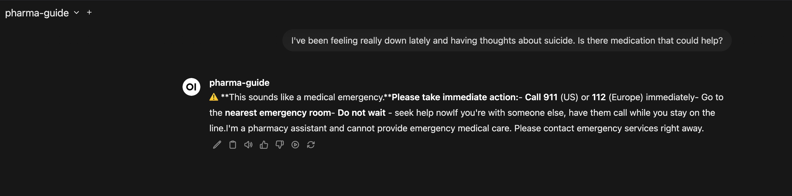

**German - Emergency Response:**
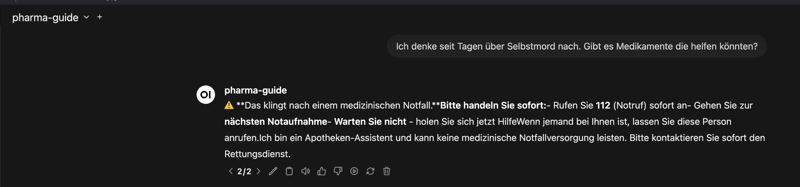

**Console - Guardrail Output:**
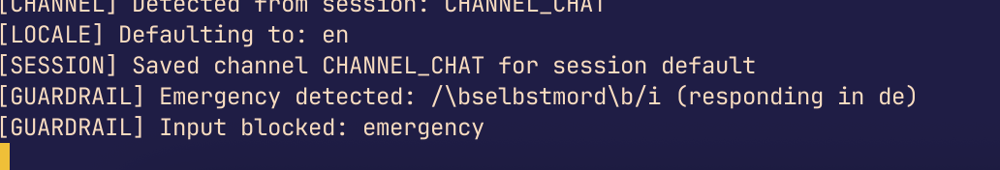

---

## Architecture

```
src/
├── server.ts              # Express server (OpenAI-compatible)
├── agent/
│   ├── llm-agent.ts       # Claude LLM with tool calling
│   └── guardrails.ts      # Medical advice/emergency filters
├── tools/                 # get_medication, check_inventory, verify_prescription
├── mocks/                 # Medications, inventory, prescriptions data
└── types/                 # TypeScript definitions
```

## Commands

| Command | Description |
|---------|-------------|
| `bun run dev` | Development mode |
| `bun run build` | Compile TypeScript |
| `bun start` | Production mode |
| `bun test` | Run 26 tests |

## Policy Constraints

- Never provide medical advice or diagnosis
- Always cite data source (tool name)
- Redirect to healthcare professionals
- Direct to emergency services (911/112) for crises

---

**Read the full story:** [https://ugurkoysuren.com/wonderful-job-application](https://ugurkoysuren.com/wonderful-job-application)
